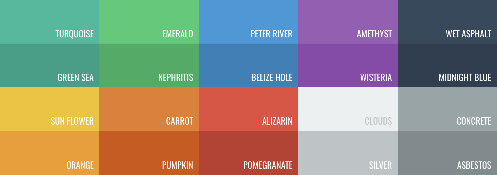

<p align="center">
    <a href="https://github.com/Juanpe/SkeletonView/workflows/build">
      
    </a>
    <a href="https://codebeat.co/projects/github-com-juanpe-skeletonview-master"></a>
    
    
    
    <a href="https://badge.bow-swift.io/recipe?name=SkeletonView&description=An%20elegant%20way%20to%20show%20users%20that%20something%20is%20happening%20and%20also%20prepare%20them%20to%20which%20contents%20he%20is%20waiting&url=https://github.com/juanpe/skeletonview&owner=Juanpe&avatar=https://avatars0.githubusercontent.com/u/1409041?v=4&tag=1.8.7"></a>   
    <br/>
    <a href="https://twitter.com/JuanpeCatalan">
        
    </a>
    <a href="https://gitter.im/SkeletonView/community?utm_source=badge&utm_medium=badge&utm_campaign=pr-badge">
        
    </a>
    <a href="https://www.paypal.com/cgi-bin/webscr?cmd=_donations&business=MJ4Y2D9DEX6FL&lc=ES&item_name=SkeletonView&currency_code=EUR&bn=PP%2dDonationsBF%3abtn_donate_SM%2egif%3aNonHosted">
        
    <a href="https://twitter.com/intent/tweet?text=Wow%20This%20library%20is%20awesome:&url=https%3A%2F%2Fgithub.com%2FJuanpe%2FSkeletonView">
      
    </a>
</p>

🌎  Traduções: </br>
[Original](https://github.com/Juanpe/SkeletonView) </br>
[🇨🇳](https://github.com/Juanpe/SkeletonView/blob/master/README_zh.md)  [@WhatsXie](https://twitter.com/WhatsXie) </br>
[🇧🇷](https://github.com/Juanpe/SkeletonView/blob/master/README_pt-br.md)  [@brunomunizaf](https://twitter.com/brunomuniz_af) </br>
[🇰🇷](https://github.com/Juanpe/SkeletonView/blob/master/README_ko.md)  [@techinpark](https://twitter.com/techinpark) </br>
[🇫🇷](https://github.com/Juanpe/SkeletonView/blob/master/README_fr.md)  [@OmarJalil](https://github.com/OmarJalil)

Hoje, quase todos os apps têm processos assíncronos, como requisições de API, processos longos, etc. E enquanto os processos estão ocorrendo, normalmente os desenvolvedores usam uma view que mostra os usuarios que algo está ocorrendo.

```SkeletonView``` foi criado para essa necessidade, um jeito elegante de mostrar aos usuários que algo está acontecendo e já prepará-los para qual conteúdo será carregado.

Aproveite! 🙂

* [Features](#-features)
* [Requerimentos](#-supported-os--sdk-versions)
* [Projeto de exemplo](#-example)
* [Instalação](#-installation)
  * [Cocoapods](#using-cocoapods)
  * [Carthage](#using-carthage)
* [Como usar](#-how-to-use)
  * [Coleções](#-collections)
  * [Texto em várias linhas](#-multiline-text)
  * [Cores customizadas](#-custom-colors)
  * [Aparência](#-appearance)
  * [Animaçōes customizadas](#-custom-animations)
  * [Hierarquia](#-hierarchy)
* [Documentação](#-documentation)
* [Próximos passos](#-next-steps)
* [Contribuindo](#-contributing)
* [Menções](#-mentions)
* [Autor](#-author)
* [Licença](#-license)


## 🌟 Features

- [x] Fácil de usar
- [x] Todas as UIViews são skeletonables
- [x] Completamente customizável
- [x] Universal (iPhone & iPad)
- [x] Interface Builder friendly
- [x] Sintaxe simples em Swift
- [x] Código leve e legível

### 📋 Versões do SDK e OS suportados

* iOS 9.0+
* tvOS 9.0+
* Swift 4.2

### 🔮 Exemplo

Para rodar o projeto de exemplo, clone o repositório e use o target `SkeletonViewExample`.

## 📲 Instalação

#### Usando [CocoaPods](https://cocoapods.org)

Edite seu `Podfile` e especifíque a dependência:

```ruby
pod "SkeletonView"
```

#### Usando [Carthage](https://github.com/carthage)

Edite seu `Cartfile` e especifíque a dependência:

```bash
github "Juanpe/SkeletonView"
```

## 🐒 Como usar

Apenas **3** passos necessários para usar `SkeletonView`:

**1.** Importe SkeletonView no lugar desejado.
```swift
import SkeletonView
```

**2.** Agora, especifíque quais views serão `skeletonables`. Você consegue fazer isso de duas formas:

**Usando código:**
```swift
avatarImageView.isSkeletonable = true
```
**Usando IB/Storyboards:**


**3.** Uma vez que você setou as views, você pode mostrar o **skeleton**. Para fazê-lo, você tem **4** escolhas:

```swift
(1) view.showSkeleton()                 // Solid
(2) view.showGradientSkeleton()         // Gradient
(3) view.showAnimatedSkeleton()         // Solid animated
(4) view.showAnimatedGradientSkeleton() // Gradient animated
```

**Pré-visualização**

<table>
<tr>
<td width="25%">
<center>Solid</center>
</td>
<td width="25%">
<center>Gradient</center>
</td>
<td width="25%">
<center>Solid Animated</center>
</td>
<td width="25%">
<center>Gradient Animated</center>
</td>
</tr>
<tr>
<td width="25%">
</img>
</td>
<td width="25%">
</img>
</td>
<td width="25%">
</img>
</td>
<td width="25%">
</img>
</td>
</tr>
</table>

> **IMPORTANTE!**
>>```SkeletonView``` é recursivo, então se você quer mostrar o esqueleto em todas as views skeletonables, você só precisa chamar o método na main container view. Por exemplo, com UIViewControllers

### 🌿 Coleções

```SkeletonView``` é compatível com ```UITableView``` e ```UICollectionView```.

###### UITableView

Se você quer mostrar o skeleton em uma ```UITableView```, você precisa conformar com o protocolo ```SkeletonTableViewDataSource```.

``` swift
public protocol SkeletonTableViewDataSource: UITableViewDataSource {
    func numSections(in collectionSkeletonView: UITableView) -> Int
    func collectionSkeletonView(_ skeletonView: UITableView, numberOfRowsInSection section: Int) -> Int
    func collectionSkeletonView(_ skeletonView: UITableView, cellIdentifierForRowAt indexPath: IndexPath) -> ReusableCellIdentifier
}
```
Como você pode ver, esse protocolo herda de ```UITableViewDataSource```, então você pode substituir esse protocolo com o protocolo do skeleton.

Esse protocolo tem uma implementação padrão:

``` swift
func numSections(in collectionSkeletonView: UITableView) -> Int
// Default: 1
```

``` swift
func collectionSkeletonView(_ skeletonView: UITableView, numberOfRowsInSection section: Int) -> Int
// Default:
// It calculates how many cells need to populate whole tableview
```

Esse é o único método que você precisa implementar para informar o skeleton sobre o cell identifier. Esse método não possui uma implementação padrão:
 ``` swift
 func collectionSkeletonView(_ skeletonView: UITableView, cellIdentifierForRowAt indexPath: IndexPath) -> ReusableCellIdentifier
 ```

**Exemplo**
 ``` swift
 func collectionSkeletonView(_ skeletonView: UITableView, cellIdentifierForRowAt indexPath: IndexPath) -> ReusableCellIdentifier {
    return "CellIdentifier"
}
 ```

> **IMPORTANTE!**
> Se você está usando resizable cells (`tableView.rowHeight = UITableViewAutomaticDimension` ), é obrigatório definir a `estimatedRowHeight`.

###### UICollectionView

Para ```UICollectionView```, você precisa conformar com o protocolo ```SkeletonCollectionViewDataSource```.

``` swift
public protocol SkeletonCollectionViewDataSource: UICollectionViewDataSource {
    func numSections(in collectionSkeletonView: UICollectionView) -> Int
    func collectionSkeletonView(_ skeletonView: UICollectionView, numberOfItemsInSection section: Int) -> Int
    func collectionSkeletonView(_ skeletonView: UICollectionView, cellIdentifierForItemAt indexPath: IndexPath) -> ReusableCellIdentifier
}
```

O resto do processo é o mesmo da ```UITableView```

### 📰 Texto de várias linhas


Quando você usar elementos com texto, ```SkeletonView``` desenha linhas para simular o texto.
Além disso, você pode decidir quantas linhas você quer. Se ```numberOfLines``` está setado para zero (0), haverá um cálculo para saber quantas linhas são necessárias para preencher o skeleton inteiro e será desenhado. Caso contrário, se você setar para um (1) ou qualquer outro número maior que zero, só serão desenhadas aquele número de linhas.

##### 🎛 Customização

Você pode setar algumas propriedades para elementos de várias linhas.


| Property | Values | Default | Preview
| ------- | ------- |------- | -------
| **Filling percent** of the last line. | `0...100` | `70%` | 
| **Corner radius** of lines. (**NEW**) | `0...10` | `0` | 


Para modificar a percentagem ou o raio **usando código**, especifique as propriedades:
```swift
descriptionTextView.lastLineFillPercent = 50
descriptionTextView.linesCornerRadius = 5
```

Ou, se você preferir use **IB/Storyboard**:


### 🎨 Cores customizadas

Você pode decidir que cor o skeleton esta pintado. Você só precisa parametrizar a cor e o gradiente que deseja.

**Usando cores sólidas**
``` swift
view.showSkeleton(usingColor: UIColor.gray) // Solid
// or
view.showSkeleton(usingColor: UIColor(red: 25.0, green: 30.0, blue: 255.0, alpha: 1.0))
```
**Usando gradientes**
``` swift
let gradient = SkeletonGradient(baseColor: UIColor.midnightBlue)
view.showGradientSkeleton(usingGradient: gradient) // Gradient
```

Além do mais, ```SkeletonView``` tem 20 cores flat 🤙🏼

```UIColor.turquoise, UIColor.greenSea, UIColor.sunFlower, UIColor.flatOrange  ...```


###### Imagem capturada do site [https://flatuicolors.com](https://flatuicolors.com)

### 🦋 Aparência

**NOVIDADE** Os skeletons tem uma aparência padrão. Então, quando você não especifíca a cor, gradiente ou propriedades de várias linhas, `SkeletonView` usa os valores padrões.

Valores padrões:
- **tintColor**: UIColor
    - *default: .clouds*
- **gradient**: SkeletonGradient
  - *default: SkeletonGradient(baseColor: .clouds)*
- **multilineHeight**: CGFloat
  - *default: 15*
- **multilineSpacing**: CGFloat
  - *default: 10*
- **multilineLastLineFillPercent**: Int
  - *default: 70*
- **multilineCornerRadius**: Int
  - *default: 0*

Para obter esses valores padrões você pode usar `SkeletonAppearance.default`. Usando essa propriedade você pode declarar os valores também:
```Swift
SkeletonAppearance.default.multilineHeight = 20
SkeletonAppearance.default.tintColor = .green
```


### 🤓 Animações customizadas

```SkeletonView``` tem duas animações pré-definidas, *pulse* para skeletons solidos e *sliding* para gradientes.

Além disso, se você quiser fazer suas próprias animações no skeleton, é muito fácil.


Skeleton disponibiliza a função `showAnimatedSkeleton` que tem o closure ```SkeletonLayerAnimation``` onde você pode definir sua animação customizada.

```swift
public typealias SkeletonLayerAnimation = (CALayer) -> CAAnimation
```

Você pode chamar esta função assim:

```swift
view.showAnimatedSkeleton { (layer) -> CAAnimation in
  let animation = CAAnimation()
  // Customize here your animation

  return animation
}
```

Está disponível ```SkeletonAnimationBuilder```. É um construtor para ```SkeletonLayerAnimation```.

Hoje, você pode criar **sliding animations** para gradientes, decidindo a **direction** e setando a **duration** da animaçāo (padrão = 1.5s).

```swift
// func makeSlidingAnimation(withDirection direction: GradientDirection, duration: CFTimeInterval = 1.5) -> SkeletonLayerAnimation

let animation = SkeletonAnimationBuilder().makeSlidingAnimation(withDirection: .leftToRight)
view.showAnimatedGradientSkeleton(usingGradient: gradient, animation: animation)

```

```GradientDirection``` é um enum, com os seguintes cases:

|  Direction | Preview
|------- | -------
| .leftRight | 
| .rightLeft | 
| .topBottom | 
| .bottomTop | 
| .topLeftBottomRight | 
| .bottomRightTopLeft | 

> **😉 TRUQUE!**
Existe outra forma de criar sliding animations, apenas usando este atalho:
>>```let animation = GradientDirection.leftToRight.slidingAnimation()```

### 👨‍👧‍👦 Hierarquia

Já que ```SkeletonView``` é recursiva, e queremos que o skeleton seja muito eficiente, queremos parar a recursão assim que possível. Por este motivo, você deve setar a container view como `Skeletonable`, porque o Skeleton vai parar de procurar por subviews `skeletonable` assim que a view não for mais skeletonable, quebrando a recursão.

Porque uma imagem vale mais que mil palavras:

> ```ìsSkeletonable```= ☠️

| Configuration | Result
|------- | -------
| | 
| | 
| | 
| | 


### 📚 Documentação
Em breve...😅

## 📬 Próximos passos

* [x] Setar o percentual de preenchimento da última linha em elementos de várias linhas
* [x] Adicionar mais animações de gradiente
* [x] Suporte para resizable cells
* [x] Compatível com CollectionView
* [x] Compatível com tvOS
* [x] Adicionar recovery state
* [x] Aparência padrão customizável
* [ ] Compatível com coleções customizáveis
* [ ] Adicionar animações quando mostra/esconde os skeletons
* [ ] Compatível com MacOS e WatchOS

## ❤️ Contribuindo
Este é um projeto de código aberto, então sinta-se a vontade para contribuir. Como?
- Abra uma [issue](https://github.com/Juanpe/SkeletonView/issues/new).
- Envie feedback por [email](mailto://juanpecatalan.com).
- Proponha seus próprios fixes, sugestões e abra um pull request com as alterações.

Ver [todos os contribuidores](https://github.com/Juanpe/SkeletonView/graphs/contributors)

###### Projeto gerado com [SwiftPlate](https://github.com/JohnSundell/SwiftPlate)

## 📢 Menções

- [iOS Dev Weekly #327](https://iosdevweekly.com/issues/327#start)
- [Hacking with Swift Articles](https://www.hackingwithswift.com/articles/40/skeletonview-makes-loading-content-beautiful)
- [Top 10 Swift Articles November](https://medium.mybridge.co/swift-top-10-articles-for-the-past-month-v-nov-2017-dfed7861cd65)
- [30 Amazing iOS Swift Libraries (v2018)](https://medium.mybridge.co/30-amazing-ios-swift-libraries-for-the-past-year-v-2018-7cf15027eee9)
- [AppCoda Weekly #44](http://digest.appcoda.com/issues/appcoda-weekly-issue-44-81899)
- [iOS Cookies Newsletter #103](https://us11.campaign-archive.com/?u=cd1f3ed33c6527331d82107ba&id=48131a516d)
- [Swift Developments Newsletter #113](https://andybargh.com/swiftdevelopments-113/)
- [iOS Goodies #204](http://ios-goodies.com/post/167557280951/week-204)
- [Swift Weekly #96](http://digest.swiftweekly.com/issues/swift-weekly-issue-96-81759)
- [CocoaControls](https://www.cocoacontrols.com/controls/skeletonview)
- [Awesome iOS Newsletter #74](https://ios.libhunt.com/newsletter/74)


## 👨🏻‍💻 Autor
[1.1]: http://i.imgur.com/tXSoThF.png
[1]: http://www.twitter.com/JuanpeCatalan

* Juanpe Catalán [![alt text][1.1]][1]

<a class="bmc-button" target="_blank" href="https://www.buymeacoffee.com/CDou4xtIK"><span style="margin-left:5px"></span></a>

## 👮🏻 Licença

```
MIT License

Copyright (c) 2017 Juanpe Catalán

Permission is hereby granted, free of charge, to any person obtaining a copy
of this software and associated documentation files (the "Software"), to deal
in the Software without restriction, including without limitation the rights
to use, copy, modify, merge, publish, distribute, sublicense, and/or sell
copies of the Software, and to permit persons to whom the Software is
furnished to do so, subject to the following conditions:

The above copyright notice and this permission notice shall be included in all
copies or substantial portions of the Software.

THE SOFTWARE IS PROVIDED "AS IS", WITHOUT WARRANTY OF ANY KIND, EXPRESS OR
IMPLIED, INCLUDING BUT NOT LIMITED TO THE WARRANTIES OF MERCHANTABILITY,
FITNESS FOR A PARTICULAR PURPOSE AND NONINFRINGEMENT. IN NO EVENT SHALL THE
AUTHORS OR COPYRIGHT HOLDERS BE LIABLE FOR ANY CLAIM, DAMAGES OR OTHER
LIABILITY, WHETHER IN AN ACTION OF CONTRACT, TORT OR OTHERWISE, ARISING FROM,
OUT OF OR IN CONNECTION WITH THE SOFTWARE OR THE USE OR OTHER DEALINGS IN THE
SOFTWARE.
```
